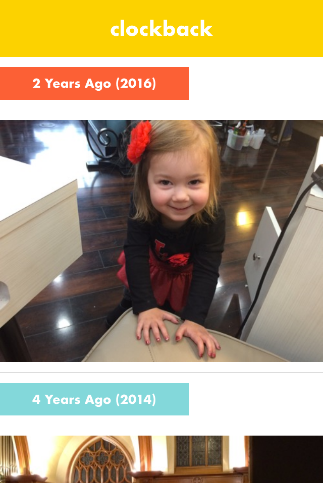

Clockback
=========
Clockback is the Web frontend and upload script for a basic open-source Timehop replacement.

How to Use Clockback
====================
Clockback consists of two parts: a single-page Web app that displays your photos from years past and a BASH script that uploads a week's worth of photos to your server.

To set up the Web app:

1. Upload the contents of the `webapp/` folder to your Web server. Let's say the public URL of this folder is `example.com/clockback/`
1. Update the timezone option in config.php to match your local timezone.

To get your photos uploaded:

1. You'll need to get your photos named and organized in such a way that their filenames all begin with the date on which they were taken.  I do this by managing all of my photos in iPhoto and then using [iPhoto Disc Export](https://github.com/cfinke/iPhoto-Disc-Export) to create an HTML-based export of the library.  This results in a single folder that contains all of the photos from my library, and all of the filenames begin with the YYYY-MM-DD format date of the date they were taken.  For the next step, we'll assume this folder's path is `/path/to/photos`
1. Run `./bin/upload.sh` on your computer at least once per week to collect photos from `/path/to/photos` and upload them to `example.com/clockback/photos/`. `upload.sh` takes a number of arguments:
    1. `-p`: The path to your photo folder. In this example, it would be `-p /path/to/photos`
    1. `-u`: The upload path for your server. In this example, it would be something like `-u example.com:~/clockback/photos/`
    1. `-t`: The timezone to use for determining today's date. Macs, for example, use UTC on the command line by default, but you probably want the script to use your local timezone. Example: `-t "America/Los_Angeles"

To use Clockback:

1. Open `example.com/clockback/` and save it to your homescreen on your phone (or bookmark it on your computer).
1. The end.  Now you have an app that behaves like Timehop but for all of your photos, and without sharing your photos with a third party.  At midnight every night, it will begin showing photos from the next day, as long as you've run `bin/upload.sh` in the last week, and it will automatically remove old photos so they don't take up space on your server.

Attributions
============
The icon was designed by [icon 54](https://thenounproject.com/term/recent-history/1939718/)